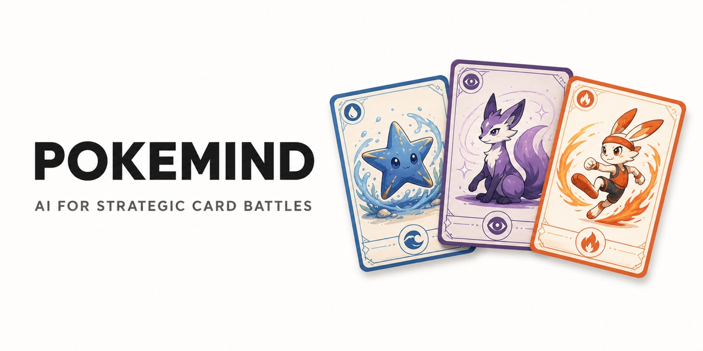
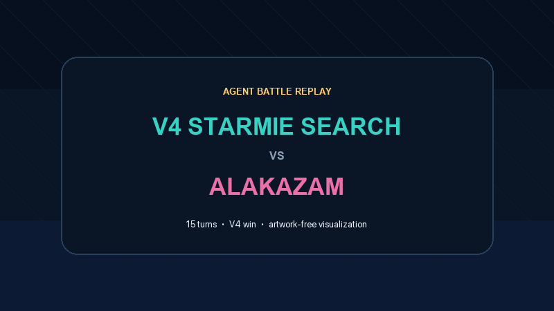
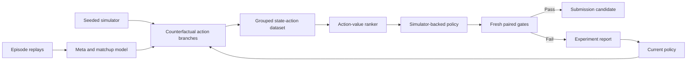

# PokeMind

[](https://github.com/markkamuya/pokemind/actions/workflows/ci.yml)



PokeMind is an experimental framework for building, evaluating, and rejecting
agents for a turn-based trading-card simulator.

The project began with hand-written heuristics and progressed through forward
search, replay imitation, adversarial evaluation, on-policy evolution, and
counterfactual action-value learning. The most important result is not a single
model: it is a reproducible process that prevents noisy local wins from becoming
bad leaderboard submissions.

> This is an independent research project. It is not affiliated with, endorsed
> by, or sponsored by The Pokémon Company, Kaggle, or their affiliates.

## Agent battle demo



This 26-second highlight reel is rendered from an authentic competition episode:
V4 defeats an Alakazam deck in 15 turns after recovering from 90/330 HP. It uses
abstract board panels and card names—no card artwork, raw replay, opponent
decision data, or simulator assets are distributed.

## Highlights

- V4 reached a **911 peak public score** and currently sits near **826**.
- Replay-derived matchup catalog and occurrence-weighted evaluation.
- Seeded, paired testing with explicit promotion gates.
- DAgger-style state collection from the policy's own trajectories.
- Counterfactual branching: evaluate every legal action by rolling it toward a
  terminal outcome.
- Dependency-free inference for exported LightGBM tree ensembles.
- Negative results are recorded alongside positive ones.

## Architecture



The policy ranker never compares unrelated rows. Actions are grouped by their
decision root, and the model learns which action should rank highest within that
state. A proven fallback remains available for conservative deployment.

Read [the architecture document](docs/ARCHITECTURE.md) for details.

## Results

Leaderboard snapshots:

| Version | Observed public score | Main approach |
|---|---:|---|
| V1 | 561.2 | Two-turn search |
| V2 | 519.8 | Fast deterministic heuristic |
| V3 | 668.9 | Tournament-selected Starmie deck |
| **V4** | **911 peak / 826 current** | Starmie sequencing and energy management |
| V5 | 762.3 | Replay-derived guards and disruption |

The counterfactual Q branch improved its Grim baseline on fresh local gates:

| Gate | Baseline | Q policy | Change |
|---|---:|---:|---:|
| Grim mirror, two batches | 125/240 | 147/240 | +9.2 pp |
| Alakazam, two batches | 174/240 | 182/240 | +3.3 pp |
| Occurrence-weighted field | 133/240 | 142/240 | +3.8 pp |
| Against V4 | 22/160 | 29/160 | +4.4 pp |

The Q policy still lost heavily to V4, so it was **not submitted**. Transferring
the same architecture to V4 also failed its complete-game gate. That failed
transfer is documented rather than hidden.

See [RESULTS.md](docs/RESULTS.md) and [EXPERIMENTS.md](docs/EXPERIMENTS.md).

## Quick start

The public core has no runtime dependencies:

```bash
python -m venv .venv
source .venv/bin/activate
python -m pip install -e .
pokemind summarize examples/benchmark_results.json
python -m unittest discover -s tests -v
```

Development tools are optional:

```bash
python -m pip install -e ".[dev]"
ruff check .
pytest
```

## Repository map

```text
src/pokemind/
├── counterfactual.py   # Decision-root datasets and regret metrics
├── gates.py            # Candidate promotion rules
├── meta.py             # Occurrence-weighted schedules
├── metrics.py          # Rates, intervals, and comparisons
├── ranker.py           # Pure-Python LightGBM inference
└── results.py          # Reproducible report generation
```

The competition adapter, simulator, card data, raw replays, trained weights,
and submission archives are deliberately excluded. See
[REPRODUCIBILITY.md](docs/REPRODUCIBILITY.md) for the boundary between public
code and user-supplied competition assets.

## Research principles

1. Use untouched seeds for final selection.
2. Compare policies on identical games whenever possible.
3. Record matchup regressions, not only aggregate win rate.
4. Promote only after multiple fresh batches.
5. Publish failed approaches and stopping decisions.
6. Never infer leaderboard performance from training accuracy alone.

## Current status

V4 remains the submission champion, with a 911 observed peak and a current
rating near 826. The next research target is hard-state
learning from fresh top-agent and V4-loss replays, with a conservative residual
policy that modifies V4 only when a counterfactual advantage survives multiple
fresh validation panels.

## License

Original code in this repository is released under the [MIT License](LICENSE).
Competition assets and third-party intellectual property are not included and
remain subject to their respective terms.

Before pushing, follow the [publishing checklist](docs/PUBLISHING.md). CI also
runs a repository safety scan that rejects credentials and excluded assets.
